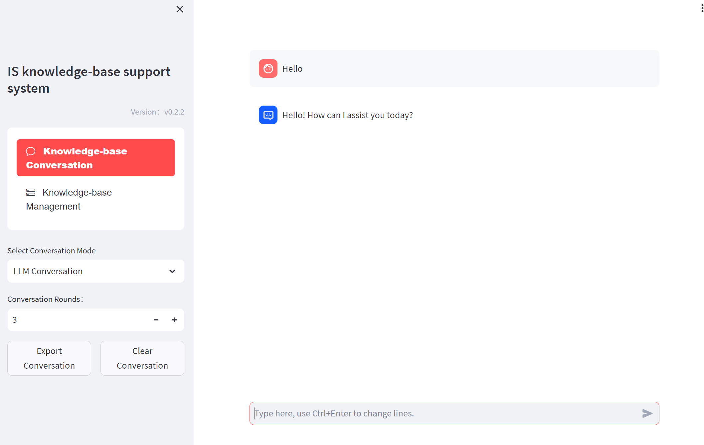

# Local AI Enhanced Knowledge-Base Support Web System

## Requirements:

`pip install -r requirements.txt`

## Models configuration:

Download Embedding model and LLM model.

Modify `configs/model_configs.py`.

Set EMBEDDING_MODEL (default m3e-base) and LLM_MODEL (default chatglm2-6b).

## Initialize knowledge-base:

`python init_database.py`

## Start LLM server:

`python server/llm_api.py`

## Start Web UI :

`streamlit run webui.py`